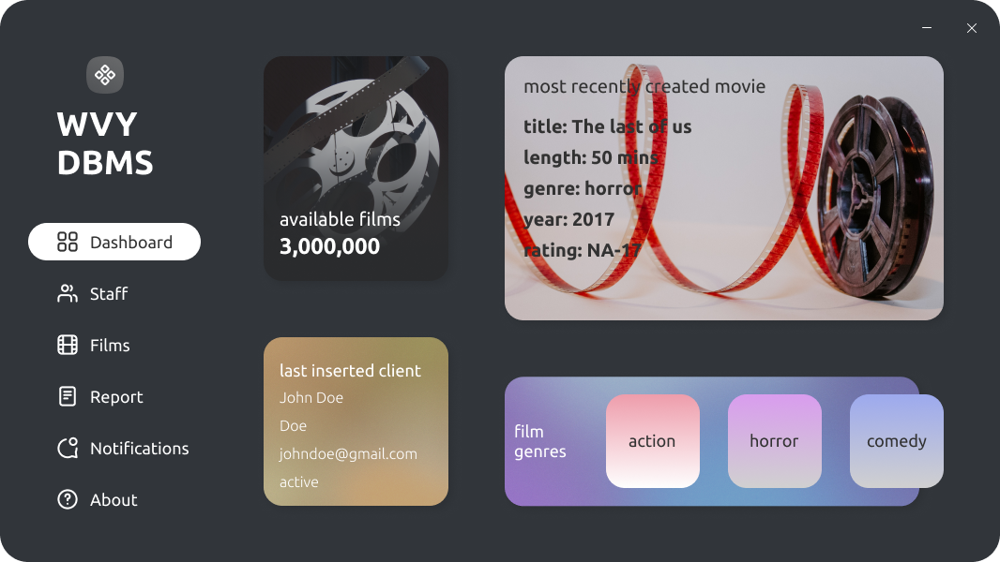

# WVY-DBMS
A movie database application with HTML, CSS and Javascript as the frontend, and Java, more specifically JAVAFX on the backend and a postgresql database

# TL; DR
1. This project was done for assignment 4 of COS221
2. This project is hosted and done in <a href="https://code.visualstudio.com/">VS Code</a> with the <a href="https://maven.apache.org/">Maven</a> build tool
3. This project has a compiled and custom runtime image(exe) here: 
4. You can fork and edit and play around with this project(if you want to) and even distribute as long as you link back to this repo as original source
5. Although this app makes use of JAVAFX, I never used native functionality to design the app but rather embeded a web app into the webview. I made this decision because of time constraints.
6. The UI was fully designed in <a href="https://www.figma.com/">figma</a>. <a href="#">Click here to access the design file</a>(Note you need to have <a href="https://www.figma.com/downloads/">figma</a> installed in order to open fig files)

# Presentation images

\
\
\
\

# How to use this project
1. First download <a href="https://code.visualstudio.com/">VS Code</a>
2. Follow this <a href="https://mkyong.com/maven/how-to-install-maven-in-windows/">article</a> to download maven and set the correct path variables
3. In VS code open the extensions tab and download and install the <a href="https://marketplace.visualstudio.com/items?itemName=vscjava.vscode-java-pack">Java extension pack</a>
