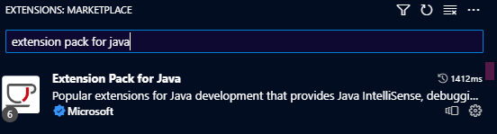
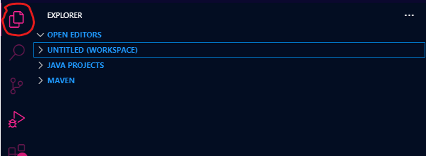

# WVY-DBMS
A movie database application with **<a href="https://developer.mozilla.org/en-US/docs/Web/HTML">HTML</a>**, **<a href="https://www.w3.org/Style/CSS/Overview.en.html">CSS</a>** and **<a href="https://developer.mozilla.org/en-US/docs/Web/JavaScript">Javascript</a>** as the frontend, and **<a href="https://www.java.com/">Java</a>**, more specifically **<a href="https://openjfx.io/">JAVAFX</a>** on the backend and a **<a href="https://www.postgresql.org/">postgresql</a>** database

# TL; DR
1. This project was done for <a href="https://www.cs.up.ac.za/module/cos221/">assignment 4 of COS221</a>
2. This project is hosted and done in <a href="https://code.visualstudio.com/">VS Code</a> with the <a href="https://maven.apache.org/">Maven</a> build tool
3. You can fork and edit and play around with this project(if you want to) and even distribute as long as you link back to this repo as original source
4. Although this app makes use of **<a href="https://openjfx.io/">JAVAFX</a>**, I never used native functionality to design the app but rather embeded a web app into the webview. I made this decision because of time constraints.
5. The UI was fully designed in <a href="https://www.figma.com/">figma</a>. <a href="https://drive.google.com/file/d/1ul2-0aOcYZJKbd5Npo7ZbMOWKqbwjlWg/view?usp=sharing">Click here to access the design file</a>(Note you need to have <a href="https://www.figma.com/downloads/">figma</a> installed in order to open fig files)

# Presentation images

\
\
\
\

# How to use this project
***NB: if you feel these instructions are unclear or confusing, please have a look below them, I have included a section with links to other forms such as instructions from VS code and JAVAFX's for setup which I used when I was setting up everything.***
1. First download and install <a href="https://code.visualstudio.com/">VS Code</a>
2. Follow this <a href="https://mkyong.com/maven/how-to-install-maven-in-windows/">article</a> to download maven and set the correct path variables. Also make sure you hava java installed. I used <a href="https://www.oracle.com/java/technologies/javase/jdk20-archive-downloads.html">jdk version 20</a>.
3. In VS code open the extensions tab and download and install the <a href="https://marketplace.visualstudio.com/items?itemName=vscjava.vscode-java-pack">Java extension pack</a>

4. At the top of the nav bar in vs code, there should be tab titled as view. Click on that then click on command pallete... and you will get a popup. \

5. Search "crate java project" in the searchbar of the popup that recently appeared
6. Click on the first reuls from search, it should be titled as "Java: Create Java Project..." then a new popup will appear with various choices
7. Click on the option that says Maven create from archetype

8. Another popup will appear but you can ignore it. To make it go away, click on the tab titled as view in the navbar. Click on command pallete and then when the command pallete appears, click anywhere outside of the command pallete popup and it will go away.
9. Download and install <a href="https://www.postgresqltutorial.com/postgresql-getting-started/install-postgresql/">postgresql</a>.
10. Set up the postgresql database by following the instructions on this article <a href="https://www.postgresqltutorial.com/postgresql-getting-started/load-postgresql-sample-database/">article</a>. I used pgAdmin as it was far easier for me to do so. The database file you need is linked <a href="https://drive.google.com/file/d/1DJPTJlTi9a4xgYaJBDIHHTPmft_xh_3_/view">here</a>. Once you have imported the database in postgresql, rename it to `u21546551_sakila`
11. Fill in the correct details in the <a href="https://github.com/waveyboym/WVY-DBMS/blob/main/wvydbms/src/main/resources/config.properties">config</a> file which you downloaded from this repo when you downloaded <a href="https://github.com/waveyboym/WVY-DBMS/tree/main/wvydbms">wvydbms</a>
12. Now that that is done, go back to VS code and click to open the explorer or press CTRL-SHIFT-E on your keyboard to open the explorer. It usually has a file looking icon. \

13. At the bottom of that side bar that would have opened, you should see a tab named as MAVEN. Before you click on it. Add this folder to your workspace: <a href="https://github.com/waveyboym/WVY-DBMS/tree/main/wvydbms">wvydbms</a>
14. If you don't know how to add a folder to a workspace <a href="https://code.visualstudio.com/docs/editor/multi-root-workspaces#:~:text=The%20File%20%3E%20Add%20Folder%20to,to%20add%20or%20remove%20folders.">follow this link</a>
15. Now click on that MAVEN tab.
16. Click on wvydbms.
17. Click on plugins
18. Click on javafx
19. Please double check to make sure you have done every step correctly otherwise Java may throw errors and Java errors are not always the easiest to deal with.
20. If everything is ready, Click on run \

21. The application should compile(could take some time) and launch.

If you have any trouble setting this application up and need clearer guidance/instructions, please send me an email at <a href="mailto:u21546551@tuks.co.za">u21546551@tuks.co.za</a>

# Other forms of setup instructions
1. VS code's official setup instructions: https://code.visualstudio.com/docs/java/java-gui
2. Javafx's official setup instructions: https://openjfx.io/openjfx-docs/

## See more details about this project here:
https://github.com/waveyboym/WVY-DBMS/blob/main/results.md
